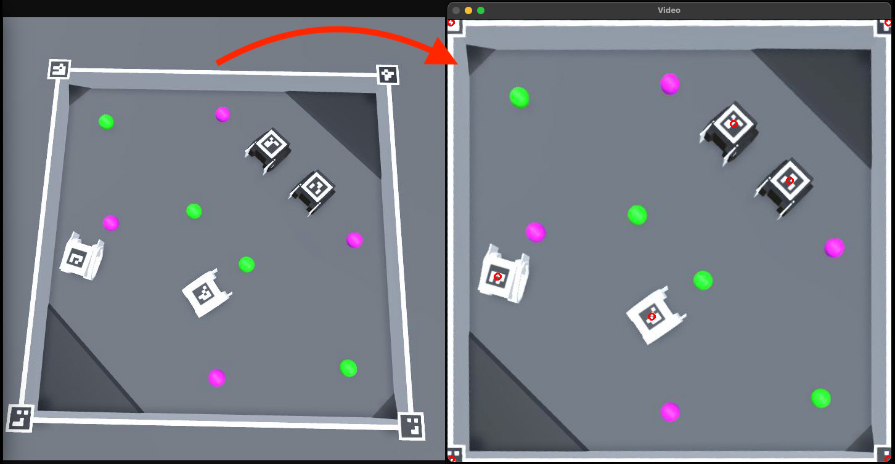

# Perspective correction based on aruco markers
This example code detects a square arena that has aruco markers (46, 47, 48, 49) at the corners. A perspective correction is then applied so that the detected corners are transformed to a square shape on screen.

The correct layout for the markers is:
- Top left: 46
- Top right: 47
- Bottom left: 48
- Bottom right: 49

This example works with [Zero Ones Simulated](https://github.com/zero-ones-given/zero-ones-simulated) version 0.0.7 or later.